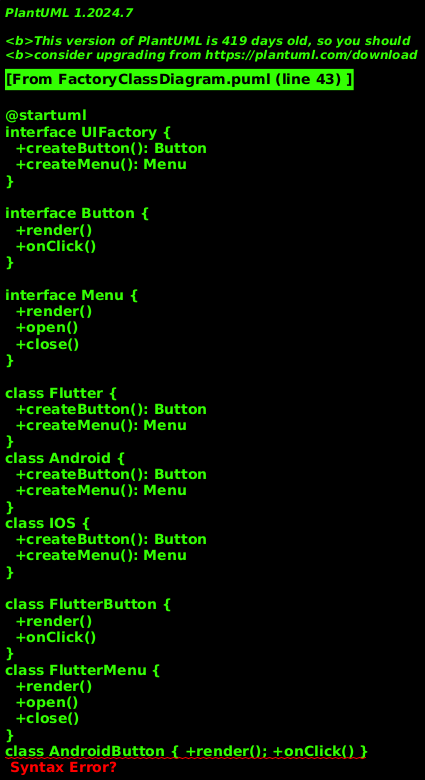
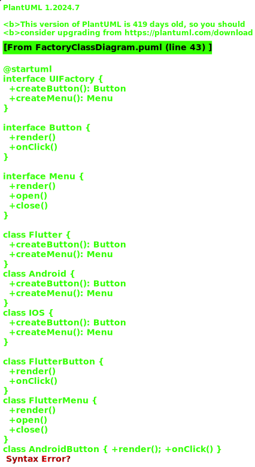
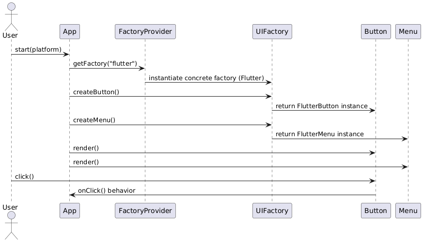
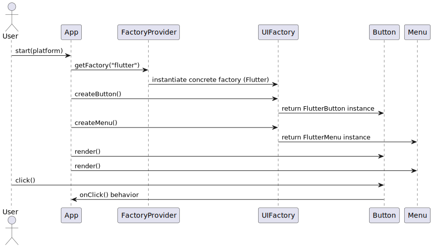
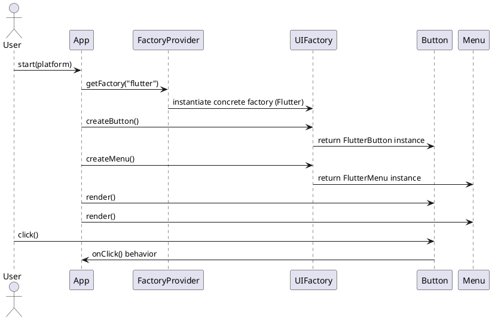

# Factory Pattern Diagrams

This document contains UML diagrams for the Factory design pattern implementation in this directory.

## Class Diagram

The class diagram shows the structure of the Factory pattern, including the abstract factory interface (UIFactory), concrete factories (Flutter, Android, IOS), product interfaces (Button, Menu), and concrete products.

### PNG Format


### SVG Format


## Sequence Diagram

The sequence diagram illustrates the runtime behavior and interaction flow when using the Factory pattern to create UI components.

### PNG Format


### SVG Format


## PlantUML Sources

### Class Diagram Source

```plantuml
@startuml
' --- Interfaces / Abstract types
interface UIFactory {
  +createButton(): Button
  +createMenu(): Menu
}

interface Button {
  +render()
  +onClick()
}

interface Menu {
  +render()
  +open()
  +close()
}

' --- Concrete factories
class Flutter {
  +createButton(): Button
  +createMenu(): Menu
}
class Android {
  +createButton(): Button
  +createMenu(): Menu
}
class IOS {
  +createButton(): Button
  +createMenu(): Menu
}

' --- Concrete products (examples)
class FlutterButton {
  +render()
  +onClick()
}
class FlutterMenu {
  +render()
  +open()
  +close()
}
class AndroidButton { +render(); +onClick() }
class AndroidMenu   { +render(); +open(); +close() }
class IOSButton     { +render(); +onClick() }
class IOSMenu       { +render(); +open(); +close() }

' --- Client
class App {
  -factory: UIFactory
  +main(args)
}

' --- Relationships
UIFactory <|.. Flutter
UIFactory <|.. Android
UIFactory <|.. IOS

Button <|.. FlutterButton
Menu   <|.. FlutterMenu

Button <|.. AndroidButton
Menu   <|.. AndroidMenu

Button <|.. IOSButton
Menu   <|.. IOSMenu

Flutter ..> FlutterButton : creates >
Flutter ..> FlutterMenu   : creates >
Android ..> AndroidButton : creates >
Android ..> AndroidMenu   : creates >
IOS ..> IOSButton         : creates >
IOS ..> IOSMenu           : creates >

App ..> UIFactory : uses >
App ..> Button : depends on >
App ..> Menu : depends on >
@enduml
```

### Sequence Diagram Source



## Regenerating Diagrams

To regenerate the PNG and SVG diagrams from the PlantUML source files, you need to have PlantUML installed. Here are the instructions:

### Prerequisites

1. Install Java (if not already installed)
2. Download PlantUML JAR file from: https://plantuml.com/download

### Commands to Regenerate Diagrams

```bash
# Generate PNG files
java -jar plantuml.jar -tpng FactoryClassDiagram.puml
java -jar plantuml.jar -tpng FactorySequenceDiagram.puml

# Generate SVG files
java -jar plantuml.jar -tsvg FactoryClassDiagram.puml
java -jar plantuml.jar -tsvg FactorySequenceDiagram.puml
```

Alternatively, you can generate all diagrams at once:

```bash
# Generate all PNG files
java -jar plantuml.jar -tpng *.puml

# Generate all SVG files
java -jar plantuml.jar -tsvg *.puml
```
