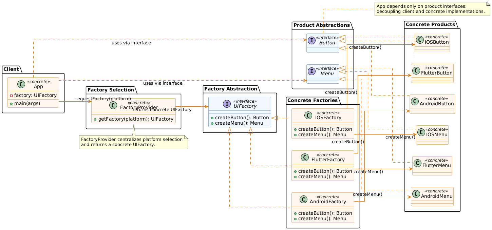

# Factory Pattern — High-Level Diagram

This directory contains a high-level conceptual diagram for the Factory design pattern. The diagram illustrates the relationship between client code, factory abstractions, concrete factories, and the product hierarchy, emphasizing how the pattern decouples object creation from concrete implementations.

## Diagram



[SVG version](./FactoryHighLevelImproved.puml.svg)

The diagram shows:
- **Client and Factory Selection**: The `App` client requests a factory via `FactoryProvider`, which returns a concrete `UIFactory` implementation based on the platform.
- **Factory and Product Abstractions**: `UIFactory` interface declares factory methods (`createButton()`, `createMenu()`), and `Button`/`Menu` interfaces define product contracts.
- **Concrete Factories and Products**: Each platform (Flutter, Android, iOS) has its own concrete factory (`FlutterFactory`, `AndroidFactory`, `IOSFactory`) that creates platform-specific products (`FlutterButton`, `AndroidButton`, etc.).
- **Decoupling**: The client depends only on the abstract `UIFactory`, `Button`, and `Menu` interfaces, not on concrete implementations, allowing easy platform switching without changing client code.

## PlantUML Source

````plantuml
@startuml
' Improved high-level Factory diagram
' - orthogonal arrows to avoid overlap
' - interfaces are styled differently from concrete classes
' - labelled interactions show flow

left to right direction
skinparam linetype ortho
skinparam shadowing false
skinparam componentStyle uml2

' Style interfaces differently
skinparam class {
  BackgroundColor<<interface>> #F2F8FF
  BorderColor<<interface>> #2B6CB0
  ArrowColor #2B6CB0
}
skinparam class {
  BackgroundColor<<concrete>> #FFF7ED
  BorderColor<<concrete>> #D97706
  ArrowColor #D97706
}

' Top row: client and factory-selection
package "Client" {
  class App <<concrete>> {
    - factory: UIFactory
    + main(args)
  }
}

package "Factory Selection" {
  class FactoryProvider <<concrete>> {
    + getFactory(platform): UIFactory
  }
}

' Middle row: abstractions
package "Factory Abstraction" {
  interface UIFactory <<interface>> {
    + createButton(): Button
    + createMenu(): Menu
  }
}

package "Product Abstractions" {
  interface Button <<interface>>
  interface Menu <<interface>>
}

' Bottom: concrete factories and concrete products (arranged horizontally to avoid overlapping arrows)
package "Concrete Factories" {
  class FlutterFactory <<concrete>> {
    + createButton(): Button
    + createMenu(): Menu
  }
  class AndroidFactory <<concrete>> {
    + createButton(): Button
    + createMenu(): Menu
  }
  class IOSFactory <<concrete>> {
    + createButton(): Button
    + createMenu(): Menu
  }
}

package "Concrete Products" {
  class FlutterButton <<concrete>>
  class FlutterMenu <<concrete>>
  class AndroidButton <<concrete>>
  class AndroidMenu <<concrete>>
  class IOSButton <<concrete>>
  class IOSMenu <<concrete>>
}

' Layout hints to reduce crossing
App -[hidden]-> FactoryProvider
FactoryProvider -[hidden]-> UIFactory
UIFactory -[hidden]-> Button
UIFactory -[hidden]-> Menu

' Relationships (interfaces vs concretes)
App --> FactoryProvider : requestFactory(platform)
FactoryProvider --> UIFactory : returns concrete UIFactory

UIFactory <|.. FlutterFactory
UIFactory <|.. AndroidFactory
UIFactory <|.. IOSFactory

Button <|.. FlutterButton
Menu   <|.. FlutterMenu

Button <|.. AndroidButton
Menu   <|.. AndroidMenu

Button <|.. IOSButton
Menu   <|.. IOSMenu

' Concrete factories create concrete products (arranged with orthogonal arrows)
FlutterFactory --> FlutterButton : createButton()
FlutterFactory --> FlutterMenu   : createMenu()

AndroidFactory --> AndroidButton : createButton()
AndroidFactory --> AndroidMenu  : createMenu()

IOSFactory --> IOSButton : createButton()
IOSFactory --> IOSMenu   : createMenu()

' App uses product interfaces (not concrete classes)
App ..> Button : uses via interface
App ..> Menu : uses via interface

' Notes showing runtime flow and benefits
note top of FactoryProvider
  FactoryProvider centralizes platform selection
  and returns a concrete UIFactory.
end note

note right of Button
  App depends only on product interfaces:
  decoupling client and concrete implementations.
end note

@enduml
````

## How to Regenerate

To regenerate the PNG and SVG diagrams from the PlantUML source, use the following commands:

### Generate PNG
```bash
java -jar plantuml.jar -tpng FactoryHighLevelImproved.puml
mv FactoryHighLevelImproved.png FactoryHighLevelImproved.puml.png
```

### Generate SVG
```bash
java -jar plantuml.jar -tsvg FactoryHighLevelImproved.puml
mv FactoryHighLevelImproved.svg FactoryHighLevelImproved.puml.svg
```

Make sure you have PlantUML installed and Graphviz available on your system for rendering.
